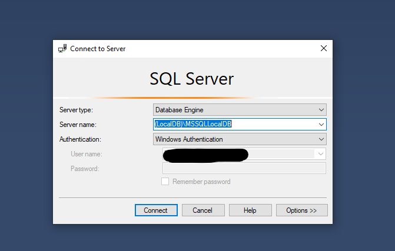
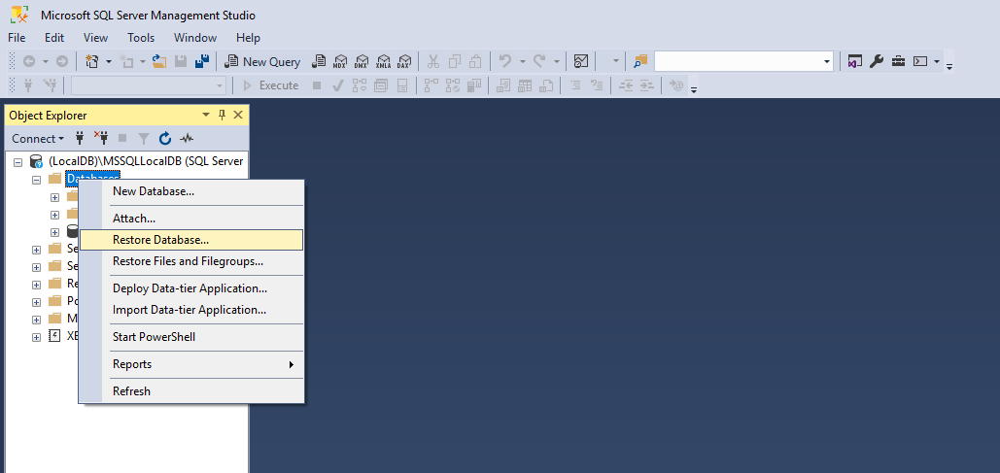
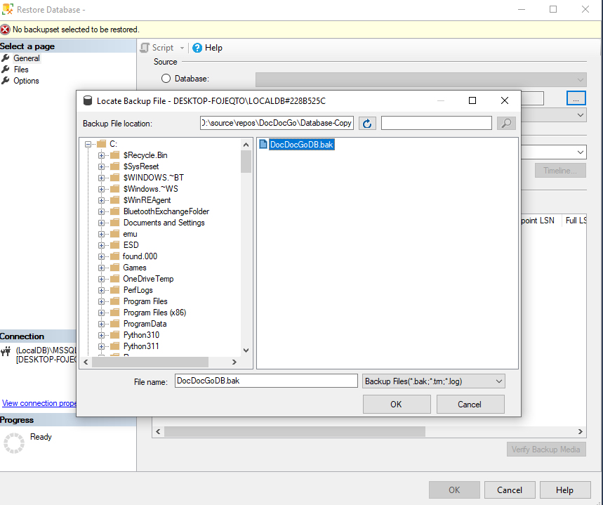
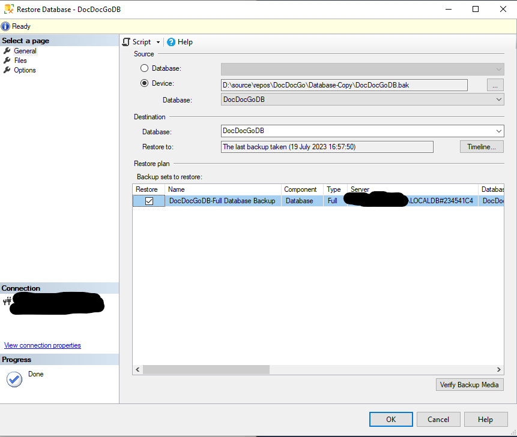

<h1 align="center">DocDocGo</h1>
<a id="top"></a>

<!-- PROJECT LOGO -->
<br />
<div align="center">
  
</div>

DocDocGo is a Hospital Management System — a web-based application designed to streamline and automate the administrative and operational processes of a hospital or medical facility. The system improves efficiency, supports patient care workflows, and provides a user-friendly interface for staff and administrators.

**Vietnamese project documentation:** [TAI_LIEU_DU_AN_DocDocGo.txt](TAI_LIEU_DU_AN_DocDocGo.txt)

<details>
  <summary>Table of Contents</summary>
  <ol>
    <li><a href="#introduction">Introduction</a></li>
    <li><a href="#features">Features</a></li>
    <li><a href="#software-architecture">Software Architecture</a></li>
    <li><a href="#technologies-used">Tech Stack</a></li>
    <li><a href="#installation">Installation</a></li>
    <li><a href="#api-usage">API Usage</a></li>
    <li><a href="#docker">Docker</a></li>
    <li><a href="#running-tests">Running Tests</a></li>
    <li><a href="#usage">Usage</a></li>
    <li><a href="#license">License</a></li>
  </ol>
</details>

## Introduction

DocDocGo was developed as a university assignment to demonstrate software engineering practices and the Software Development Life Cycle (SDLC).

The system offers a comprehensive range of features to manage patient records, appointments, prescriptions, medical staff, and other essential aspects of hospital operations.

Notable additions include **ASP.NET Core Identity** for web authentication and **JWT Bearer authentication** for the REST API, with role-based authorization for Administrator and Staff users.

## Features

### Patient Management
- Register and manage patient information.
- Assign unique patient IDs for easy identification.
- Track appointments, personal information, and reports associated with each patient.

### Appointment Scheduling
- Book appointments with patients online.
- Calendar view powered by FullCalendar.
- Reschedule and cancel appointments.

### Prescription Management
- Create, view, update, and delete prescriptions linked to patients.
- Available via web UI and REST API.

### Staff Management
- Maintain a database of doctors, nurses, and other personnel.
- Track contact information, roles, and account settings via the administrative portal.

### Administrative Security
- User management with ASP.NET Core Identity.
- Reassign roles, lock accounts, two-factor authentication, and password recovery.

### Reporting and Exporting
- Generate customizable reports from patient data.
- Save report templates for reuse.
- Export to `.xlsx` format (ClosedXML).

### REST API
- Full REST API with JWT authentication under `/api/*`.
- Swagger documentation at `/api/docs` (Development mode).
- Health checks at `/health` and `/health/ready`.
- Web UI modules (Patients, Appointments, Prescriptions, Reports) call the API via `api-client.js`.

## Software Architecture

This project includes a complete Software Architecture report meeting SA requirements:

- **Report:** [docs/SA_REPORT.md](docs/SA_REPORT.md) — export to PDF for submission
- **Architecture:** Layered (N-tier) monolith + REST API
- **Patterns:** Repository pattern, DTOs for API, dual auth (Cookie + JWT)
- **DevOps:** GitHub Actions CI/CD, Docker, docker-compose, optional Azure deploy workflow
- **Quality:** Unit tests (xUnit), Serilog logging, health checks, request logging middleware

## Technologies Used

| Layer | Technologies |
|---|---|
| Frontend | HTML, CSS, JavaScript, jQuery, Razor Pages, Bootstrap, FullCalendar |
| Backend | ASP.NET Core 6.0, Web API, ASP.NET Core Identity |
| API | JWT Bearer, Swagger/OpenAPI, DTOs |
| Database | SQL Server, Entity Framework Core |
| DevOps | GitHub Actions, Docker, Serilog, Health Checks, xUnit |
| Libraries | ClosedXML, SendGrid, iText7 |

## Installation

1. Clone this repository:

```sh
git clone https://github.com/Wraami/DocDocGo.git
cd DocDocGo
```

2. Restore dependencies and build:

```sh
dotnet restore
dotnet build
```

3. Set up the database (see below).

### Restore the Database

Set up SQL Server using SQL Server Management Studio (SSMS).

Connect to `(localdb)\MSSQLLocalDB` or your local SQL Server instance.



In Object Explorer, right-click **Databases** → **Restore Database...**



Choose **Device** as the source, click **...**, then **Add** and browse to `Database-Copy/DocDocGoDB.bak`.



Click **OK**, then confirm the restore dialog:



After restore completes, refresh Object Explorer and verify **DocDocGoDB** appears.

If you renamed the database during restore, update `HospitalManagementSQLConnection` in `appsettings.json`.

**Troubleshooting:** If restore fails because the database already exists, take it offline first (Tasks → Take Offline) and drop active connections.

### Run Locally

```sh
dotnet run
```

Default URLs (see `Properties/launchSettings.json`):
- HTTPS: https://localhost:7170
- HTTP: http://localhost:5144

## API Usage

1. Obtain a JWT token:

```http
POST /api/auth/login
Content-Type: application/json

{ "email": "pavel.sanjah-staff@hospitaltrust.com", "password": "Password123-_" }
```

2. Use the token in subsequent requests:

```http
GET /api/patients
Authorization: Bearer <your-token>
```

3. Open Swagger UI at `/api/docs` when running in Development.

### API Endpoints (summary)

| Resource | Base route |
|---|---|
| Auth | `/api/auth` |
| Patients | `/api/patients` |
| Appointments | `/api/appointments` |
| Prescriptions | `/api/prescriptions` |
| Reports | `/api/reports` |

## Docker

```sh
docker-compose up --build
```

- Application: http://localhost:8080
- SQL Server: localhost:1433 (SA password configured in `docker-compose.yml`)

## Running Tests

```sh
dotnet test
```

Test project: `DocDocGo.Tests` (repository unit tests).

## Usage

Start the project in Visual Studio or with `dotnet run`, then open https://localhost:7170 in your browser.

### Administrator

```
Email: sarah-admin@hospitaltrust.com
Password: Password123-_
```

### Staff member

```
Email: pavel.sanjah-staff@hospitaltrust.com
Password: Password123-_
```

## License

DocDocGo is open-source software licensed under the [MIT License](LICENSE).

<p align="right">(<a href="#top">back to top</a>)</p>
