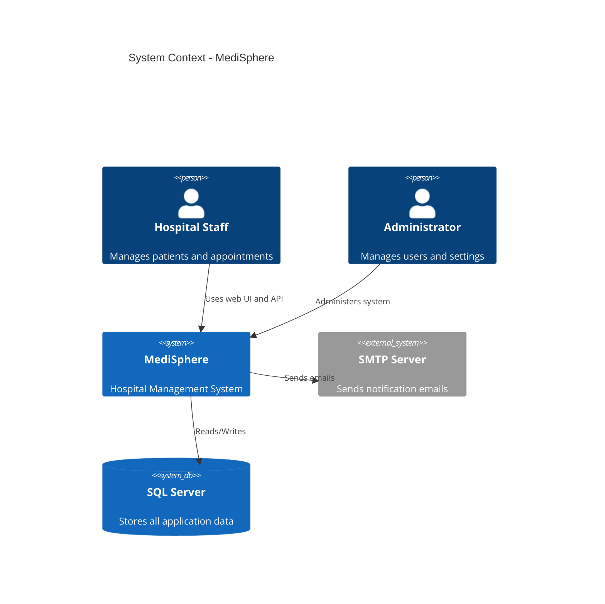
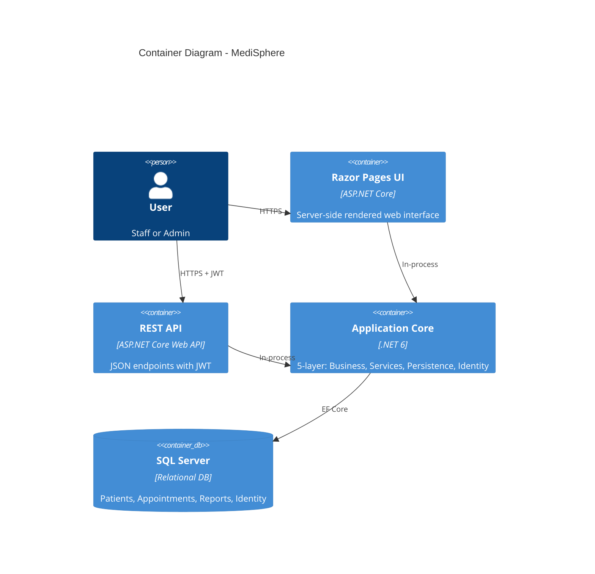
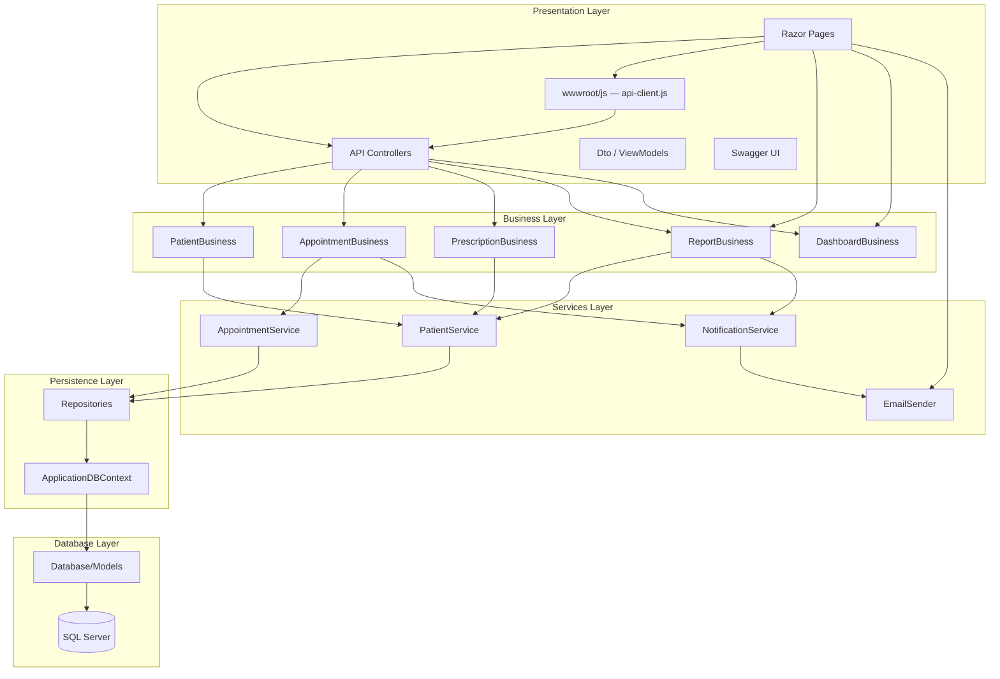
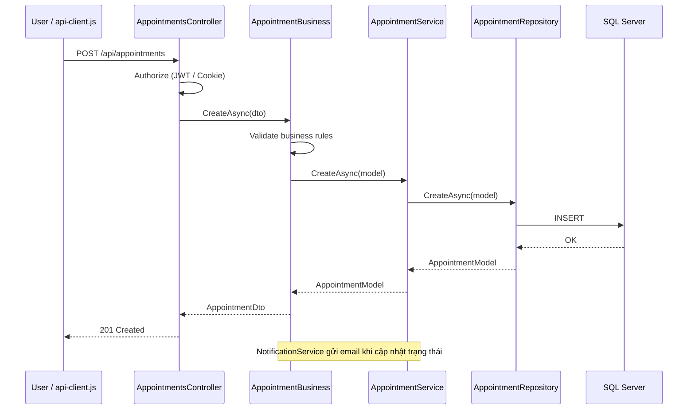
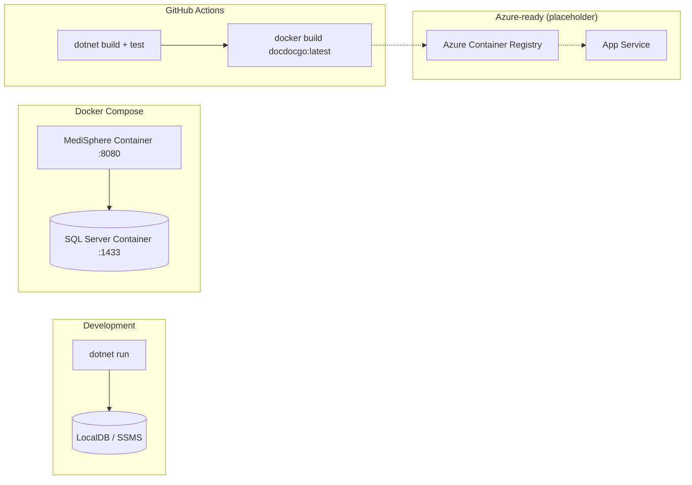

# BÁO CÁO LUẬN THIẾT KẾ KIẾN TRÚC PHẦN MỀM
## MediSphere — Hospital Management System

**Môn học:** Thiết kế Kiến trúc Phần mềm  
**Tài liệu tham khảo:** *Fundamentals of Software Architecture* — Mark Richards & Neal Ford  
**Công nghệ:** ASP.NET Core 6.0, Entity Framework Core, SQL Server  
**Ngày cập nhật:** 09/06/2026

---

## Mục lục

1. [Introduction](#1-introduction)
2. [System Requirements](#2-system-requirements)
3. [Architecture Selection](#3-architecture-selection)
4. [Architecture Design](#4-architecture-design)
5. [Technical Design](#5-technical-design)
6. [Implementation](#6-implementation)
7. [Evaluation](#7-evaluation)
8. [Conclusion](#8-conclusion)

---

## 1. Introduction

### 1.1 Giới thiệu hệ thống

**MediSphere** là hệ thống quản lý bệnh viện (Hospital Management System) hỗ trợ:

- Quản lý hồ sơ bệnh nhân
- Đặt lịch hẹn khám bệnh
- Quản lý đơn thuốc (Prescriptions)
- Tạo và xuất báo cáo y tế
- Quản trị nhân viên và phân quyền

Hệ thống phục vụ bệnh viện quy mô vừa và nhỏ, triển khai dạng **monolithic web application** với giao diện Razor Pages và **REST API** cho tích hợp bên thứ ba.

### 1.2 Mục tiêu

| Mục tiêu | Mô tả |
|---|---|
| Nghiệp vụ | Tự động hóa quy trình hành chính y tế |
| Kỹ thuật | Áp dụng Layered Architecture, Repository Pattern, REST API |
| Bảo mật | ASP.NET Identity, JWT, phân quyền theo vai trò |
| Chất lượng | Logging, health checks, unit tests, CI/CD |

---

## 2. System Requirements

### 2.1 Business Context

Bệnh viện cần một hệ thống tập trung thay thế quy trình giấy tờ, giảm sai sót và tăng hiệu quả phối hợp giữa bác sĩ, y tá và quản trị viên.

### 2.2 Stakeholders

| Stakeholder | Vai trò | Nhu cầu chính |
|---|---|---|
| **Administrator** | Quản trị hệ thống | Quản lý user, phân quyền, khóa tài khoản |
| **Staff (Bác sĩ/Y tá)** | Nhân viên y tế | Quản lý bệnh nhân, lịch hẹn, đơn thuốc, báo cáo |
| **Bệnh nhân** | Đối tượng được phục vụ | Hồ sơ chính xác, lịch hẹn đúng giờ (gián tiếp) |
| **IT Department** | Vận hành kỹ thuật | Triển khai, monitoring, backup, bảo mật |

### 2.3 Functional Requirements (FR)

| ID | Yêu cầu | Trạng thái |
|---|---|---|
| FR-01 | Đăng nhập / đăng ký công khai (`/Account/Register`) / đăng xuất / quên mật khẩu / xác nhận email | ✅ |
| FR-02 | Phân quyền Administrator và Staff | ✅ |
| FR-03 | CRUD bệnh nhân | ✅ |
| FR-04 | CRUD lịch hẹn + lịch FullCalendar | ✅ |
| FR-05 | CRUD đơn thuốc | ✅ |
| FR-06 | Tạo báo cáo, template, xuất Excel | ✅ |
| FR-07 | Quản trị nhân viên (Admin) | ✅ |
| FR-08 | REST API cho tất cả module chính | ✅ |
| FR-09 | JWT authentication cho API | ✅ |
| FR-10 | Tìm kiếm bệnh nhân (client-side) | ✅ |

### 2.4 Non-Functional Requirements (NFR)

| Thuộc tính | Yêu cầu | Giải pháp trong MediSphere |
|---|---|---|
| **Scalability** | Hỗ trợ tăng tải theo thời gian | Layered monolith; có thể tách API/Microservices sau; Docker-ready |
| **Performance** | Phản hồi < 3s cho thao tác thường | EF Core + SQL Server; Repository pattern; logging đo thời gian request |
| **Availability** | Uptime cao trong giờ làm việc | Health checks `/health`, `/health/ready`; CI/CD tự động build |
| **Security** | Bảo vệ dữ liệu y tế | Identity, roles, lockout, JWT, HTTPS, `[Authorize]` |
| **Maintainability** | Dễ bảo trì, mở rộng | Kiến trúc 5 tầng (Presentation → Business → Services → Persistence → Database); DI; unit tests; migrations |

---

## 3. Architecture Selection

### 3.1 Các lựa chọn kiến trúc

| Kiến trúc | Ưu điểm | Nhược điểm |
|---|---|---|
| **Layered (N-tier)** | Đơn giản, dễ hiểu, phù hợp team nhỏ | Khó scale độc lập từng layer |
| **Microservices** | Scale độc lập, deploy riêng | Phức tạp, cần DevOps mạnh |
| **Event-driven** | Loose coupling, async | Overkill cho quy mô hiện tại |
| **Services-based** | Tách service theo domain | Cần service mesh, API gateway |

### 3.2 Quyết định: Layered Architecture + REST API

**Lý do chọn:**

1. Phù hợp quy mô bệnh viện vừa/nhỏ và team phát triển nhỏ
2. ASP.NET Core Razor Pages + Web API trong cùng project — triển khai đơn giản
3. Repository Pattern tách biệt data access — dễ test và bảo trì
4. Có thể evolve sang Microservices khi cần scale

### 3.3 Trade-offs

| Trade-off | Quyết định | Hệ quả |
|---|---|---|
| Monolith vs Microservices | Monolith | Deploy nhanh; scale vertical trước |
| SSR vs SPA | Razor Pages + jQuery | SEO tốt, dev nhanh; UX kém hơn SPA |
| Cookie vs JWT | Cả hai | Cookie cho web UI; JWT cho API clients |
| SQL Server vs NoSQL | SQL Server | ACID, quan hệ phức tạp; scale horizontal khó hơn |

---

## 4. Architecture Design

### 4.1 C4 Model — Context Diagram



### 4.2 C4 Model — Container Diagram



### 4.3 Component Diagram — Kiến trúc 5 tầng

MediSphere triển khai **Layered Architecture 5 tầng**. Luồng xử lý đi từ trên xuống; mỗi tầng chỉ giao tiếp với tầng ngay bên dưới.



| Tầng | Thư mục | Trách nhiệm |
|---|---|---|
| **Presentation** | `Pages/`, `Api/`, `Dto/`, `ViewModels/`, `wwwroot/` | Razor UI, REST controllers, DTOs, client JS (`MediSphereApi`) |
| **Business** | `Business/` | Validation nghiệp vụ, mapping DTO, `BusinessResult<T>` |
| **Services** | `Services/` | Orchestration CRUD, email, thông báo lịch hẹn/báo cáo |
| **Persistence** | `Persistence/` | Repository pattern — truy cập EF Core |
| **Database** | `Database/`, `Migrations/` | Entities, `ApplicationDBContext`, schema SQL Server |

**Đăng ký DI:** `DependencyInjection/ServiceCollectionExtensions.cs` → `AddMediSphereLayers()` (gọi từ `Program.cs`).

**Luồng điển hình (API):** `PatientsController` → `IPatientBusiness` → `IPatientService` → `IRepository<PatientModel>` → `ApplicationDBContext`.

**Luồng điển hình (UI list):** Razor Page → `api-client.js` → REST API → Business → Services → Persistence (dual interface, cùng business logic).

### 4.4 Data Flow Diagram — Tạo lịch hẹn



### 4.5 Deployment Diagram



### 4.6 Domain Partitioning

| Domain | Presentation | Business | Services | Persistence | Entities |
|---|---|---|---|---|---|
| **Identity** | `Pages/Account/*`, `AuthController` | — | `EmailSender` | Identity EF stores | `UserModel` |
| **Patient** | `Pages/Patient/*`, `PatientsController` | `PatientBusiness` | `PatientService` | `PatientRepository` | `PatientModel` |
| **Appointment** | `Pages/Appointments/*`, `AppointmentsController` | `AppointmentBusiness` | `AppointmentService`, `NotificationService` | `AppointmentRepository` | `AppointmentModel` |
| **Prescription** | `Pages/Prescriptions/*`, `PrescriptionsController` | `PrescriptionBusiness` | `PrescriptionService` | `PrescriptionRepository` | `PrescriptionModel` |
| **Reporting** | `Pages/Reports/*`, `ReportsController` | `ReportBusiness` | `ReportService`, `ReportTypeService` | `ReportRepository`, `ReportTypeRepository` | `ReportModel`, `ReportTypeModel` |
| **Dashboard** | `Pages/Index` | `DashboardBusiness` | `DashboardService` | (aggregate queries) | — |

---

## 5. Technical Design

### 5.1 REST API Design

**Base URL:** `/api`  
**Authentication:** `POST /api/auth/login` → JWT Bearer token  
**Documentation:** Swagger UI tại `/api/docs` (Development)

| Method | Endpoint | Mô tả |
|---|---|---|
| POST | `/api/auth/login` | Đăng nhập, nhận JWT |
| GET | `/api/patients` | Danh sách bệnh nhân |
| GET | `/api/patients/{id}` | Chi tiết bệnh nhân |
| POST | `/api/patients` | Tạo bệnh nhân |
| PUT | `/api/patients/{id}` | Cập nhật |
| DELETE | `/api/patients/{id}` | Xóa (Admin only) |
| GET/POST/PUT/DELETE | `/api/appointments` | CRUD lịch hẹn |
| GET/POST/PUT/DELETE | `/api/prescriptions` | CRUD đơn thuốc |
| GET | `/api/reports` | Danh sách báo cáo |

### 5.2 Data Model (ER Overview)

```
User (Identity) ── Staff accounts
Patient ──< Appointment
Patient ──< Prescription
Patient ──< Report
ReportType ──< Report
```

**Entities:** UserModel, PatientModel, AppointmentModel, PrescriptionModel, ReportModel, ReportTypeModel

### 5.3 Integration

| Integration | Công nghệ |
|---|---|
| Email | SMTP (EmailSender) |
| Excel Export | ClosedXML |
| Calendar UI | FullCalendar (CDN) |
| API Clients | REST + JWT |

### 5.4 Architectural Concepts Applied

| Concept | Application |
|---|---|
| **Modularity** | Tách `Pages/`, `Api/`, `Business/`, `Services/`, `Persistence/`, `Database/` |
| **Coupling** | API/PageModel inject `*Business`, không gọi trực tiếp DbContext; Repository interface giảm coupling |
| **Cohesion** | Mỗi `*Business` / `*Service` / `*Repository` phục vụ một domain entity |
| **Data Consistency** | EF Core transactions, SQL Server ACID; validation tại Business layer |

---

## 6. Implementation

### 6.1 Công nghệ sử dụng

| Layer | Technology |
|---|---|
| Presentation | Razor Pages, Bootstrap 5, jQuery, FullCalendar, `api-client.js`, theme `siteTheme.css` |
| API | ASP.NET Core Web API, Swagger, DTOs, JWT Bearer |
| Business | `*Business` classes, `BusinessResult<T>`, validation rules |
| Services | `*Service`, `EmailSender`, `NotificationService` (SMTP) |
| Persistence | Repository pattern, EF Core 6 |
| Database | SQL Server, EF Migrations |
| Auth | ASP.NET Identity (Cookie) + JWT (`AuthSchemes.JwtOrCookie`) |
| Logging | Serilog (console + `logs/docdocgo-*.log`) |
| Monitoring | Health Checks (`/health`, `/health/ready`), `RequestLoggingMiddleware` |
| Testing | xUnit, EF InMemory (4 repository tests) |
| DevOps | GitHub Actions CI/CD, Docker, docker-compose |

### 6.2 Cấu trúc project

```
MediSphere/
├── Api/Controllers/           # REST API (Presentation)
├── Business/                  # Business layer — validation, DTO mapping
│   └── Interfaces/
├── Services/                  # Application services, email, notifications
│   └── Interfaces/
├── Persistence/               # Repository pattern (data access)
│   └── Interfaces/
├── Database/
│   ├── Models/                # Entity models
│   └── DAL/                   # ApplicationDBContext
├── Dto/                       # API data transfer objects
├── ViewModels/                # Razor Page view models
├── Pages/                     # Razor UI (Presentation)
│   ├── Account/               # Login, Register, ForgotPassword, ...
│   ├── Administrator/         # Admin-only staff management
│   ├── Patient/, Appointments/, Prescriptions/, Reports/
│   └── Shared/                # _DashboardLayout, _AuthLayout, ...
├── DependencyInjection/       # AddMediSphereLayers()
├── Middleware/                # RequestLoggingMiddleware
├── Migrations/                # EF Core migrations
├── wwwroot/
│   ├── css/siteTheme.css      # Teal/slate medical theme
│   ├── js/                    # api-client.js, appointments.js, ...
│   └── resources/             # logo-two.svg, main-logo.svg
├── MediSphere.Tests/          # Unit tests (Persistence)
├── docs/
│   ├── SA_REPORT.md           # Báo cáo này
│   └── SA_EVALUATION.md       # Đánh giá theo rubric đề bài
├── .github/workflows/         # dotnet.yml (CI/CD), azure-deploy.yml
├── Dockerfile
└── docker-compose.yml
```

### 6.3 Demo

1. Chạy ứng dụng: `dotnet run`
2. Web UI: `https://localhost:7170`
3. API docs: `https://localhost:7170/api/docs`
4. Health: `https://localhost:7170/health`
5. Login API:
   ```json
   POST /api/auth/login
   { "email": "pavel.sanjah-staff@hospitaltrust.com", "password": "Password123-_" }
   ```

### 6.4 CI/CD & Cloud Readiness

- **GitHub Actions** (`.github/workflows/dotnet.yml`): restore → build Release → test → Docker image `docdocgo:latest` on push
- **Docker:** `Dockerfile` multi-stage build; `docker-compose.yml` — App (:8080) + SQL Server (:1433)
- **Azure-ready:** `.github/workflows/azure-deploy.yml` (placeholder ACR/App Service); secrets qua env vars / Key Vault khi triển khai production
- **Observability:** Serilog file rolling, health checks SQL Server tag `ready`, request timing middleware

### 6.5 Giao diện người dùng (cập nhật 06/2026)

| Khía cạnh | Triển khai |
|---|---|
| Layout | Sidebar tối cố định + top bar (`_DashboardLayout.cshtml`) |
| Typography / màu | Plus Jakarta Sans; palette teal/slate (`siteTheme.css`) |
| Auth UI | Card trung tâm, tab Login / Register (`_AuthLayout.cshtml`) |
| Branding | SVG placeholder tại `wwwroot/resources/logo-two.svg`, `main-logo.svg` |
| Trạng thái (status) | Dropdown **1-based** — ví dụ `1 - Scheduled`, `1 - Created` (thay giá trị 100-based cũ) |
| Modal / form | Gỡ nhãn **(API)** khỏi tiêu đề và nút submit; UI vẫn gọi REST qua `api-client.js` |
| DateTime picker | Bootstrap 5 compatibility, thứ tự script, z-index modal cho Appointments |

### 6.6 Luồng đăng ký & xác thực

| Luồng | Route | Mô tả |
|---|---|---|
| Đăng ký công khai | `/Account/Register` | `[AllowAnonymous]` — tài khoản mới nhận role **Staff**, email xác nhận qua SMTP |
| Đăng ký Admin | `/Administrator/Register` | Chỉ Administrator — tạo nhân viên với role tùy chọn |
| Đăng nhập web | `/Account/Login` | Cookie-based Identity |
| Đăng nhập API | `POST /api/auth/login` | JWT Bearer token |
| Dual auth | `AuthSchemes.JwtOrCookie` | API trả 401/403 JSON; web redirect login |
| Khôi phục mật khẩu | `/Account/ForgotPassword` | Token qua email (`EmailSender`) |
| 2FA | `/Account/Manage/*` | TOTP, recovery codes (Identity mặc định) |

### 6.7 Kiểm thử

| Kiểm tra | Kết quả (09/06/2026) |
|---|---|
| `dotnet build MediSphere.sln -c Release` | Thành công (0 lỗi) |
| `dotnet test MediSphere.sln -c Release` | **4/4 passed** |
| Phạm vi test | `PatientRepositoryTests`, `PrescriptionRepositoryTests` (EF InMemory) |

---

## 7. Evaluation

### 7.1 Điểm mạnh kiến trúc

- Kiến trúc **5 tầng** rõ ràng (Presentation → Business → Services → Persistence → Database)
- Dual interface: Web UI + REST API dùng chung business logic
- Security đa lớp (Identity, roles, JWT, HTTPS, lockout)
- Observability cơ bản (Serilog, health checks, request timing)
- Testable qua Repository + unit tests; DI tập trung `AddMediSphereLayers()`
- UI chuyên nghiệp, branding SVG, luồng đăng ký Staff công khai

### 7.2 Điểm yếu và rủi ro

| Rủi ro | Mức độ | Giảm thiểu |
|---|---|---|
| Monolith scaling | Trung bình | Docker, vertical scale, tách API sau |
| Single DB bottleneck | Trung bình | Indexing, read replicas khi cần |
| No distributed tracing | Thấp | Thêm Application Insights / OpenTelemetry |
| Secret in appsettings | Cao (prod) | Azure Key Vault / env variables |

### 7.3 Quality Attributes Assessment

| Attribute | Score (1-5) | Ghi chú |
|---|---|---|
| Scalability | 3 | Monolith; API-ready for split |
| Performance | 4 | Đủ cho quy mô vừa |
| Availability | 3 | Health checks; chưa HA cluster |
| Security | 4 | Identity + JWT + roles |
| Maintainability | 5 | 5-layer, DI, domain folders, tests |

> **Đánh giá độc lập chi tiết:** xem [docs/SA_EVALUATION.md](SA_EVALUATION.md) — đối chiếu rubric `SA requirements.docx`.

### 7.4 Evolution khi Scale

1. **Giai đoạn 1 (hiện tại):** Monolith + SQL Server
2. **Giai đoạn 2:** Tách read API, cache Redis
3. **Giai đoạn 3:** Microservices theo domain (Patient, Appointment, Report)
4. **Giai đoạn 4:** Event-driven cho notifications (RabbitMQ/Azure Service Bus)

---

## 8. Conclusion

### 8.1 Tổng kết

MediSphere đáp ứng yêu cầu bài luận SA bằng cách:

- Chọn domain cụ thể (quản lý bệnh viện)
- Phân tích đầy đủ FR/NFR và stakeholders
- Lựa chọn Layered Architecture với trade-off analysis
- Thiết kế sơ đồ C4, component, data flow
- Thiết kế REST API với Swagger
- Triển khai code hoàn chỉnh với kiến trúc 5 tầng, tests, logging, CI/CD, Docker
- Giao diện redesign, đăng ký công khai, tài liệu README + SA_EVALUATION

### 8.2 Hướng phát triển

- Mobile app qua REST API
- Azure deployment với Application Insights
- Microservices decomposition
- HL7/FHIR integration cho chuẩn y tế quốc tế

---

## Phụ lục: Rubrics Self-Assessment

| Tiêu chí | Điểm tối đa | Tự đánh giá |
|---|---|---|
| Phân tích yêu cầu | 15 | 14 |
| Lựa chọn kiến trúc | 15 | 14 |
| Thiết kế kiến trúc | 20 | 18 |
| Áp dụng kiến thức sách | 15 | 14 |
| Implementation | 10 | 9 |
| Đánh giá & trade-offs | 10 | 9 |
| Báo cáo & trình bày | 10 | 9 |
| Sáng tạo & mở rộng | 5 | 4 |
| **Bonus (CI/CD, Docker, Logging)** | +10 | +6 |
| **Tổng ước lượng** | **110** | **~97** |

---

*Báo cáo này có thể export sang PDF để nộp bài. Source code: repository MediSphere.*
